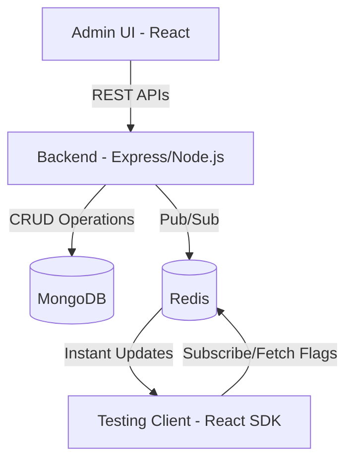

Here’s a **professional and GitHub-ready README.md** for your final capstone project — cleanly formatted, visually structured, and descriptive:

---

# 🚀 Real-Time Feature Flag Management System (MERN + Redis)

### 🧑‍💻 Team Members

* **Ravkirat Singh** – UID: 23BAI70498
* **Dhairya Sharma** – UID: 23BAI70388

---

## 📘 Overview

The **Real-Time Feature Flag Management System** is a dynamic control platform built using the **MERN stack** (MongoDB, Express, React, Node.js) integrated with **Redis** for real-time communication.

This system allows developers and operators to **enable, disable, or target features** at runtime — without redeploying or restarting the application. It supports **progressive delivery, A/B testing**, and **continuous deployment** environments.

---

## 🧩 Project Components

The system is divided into three major modules:

### 1. 🖥️ Admin UI (`admin-ui/`)

* React-based dashboard for creating, editing, and managing feature flags.
* Simulate rollouts and monitor flag states in real-time.

### 2. ⚙️ Backend API (`backendd/`)

* Node.js + Express backend connected to MongoDB and Redis.
* Provides RESTful APIs for flag creation, evaluation, and configuration.
* Uses **Redis Pub/Sub** for instant flag propagation and **MongoDB** for persistent storage.

### 3. 🧪 Testing Client (`testing-app/`)

* A sample React app demonstrating feature flag consumption via a lightweight SDK.
* Subscribes to real-time flag updates and dynamically changes UI/behavior.

---

## 🎯 Objectives

* ✅ Build a **real-time feature flag management system** using MERN + Redis.
* ✅ Dynamically **toggle and target features** based on environment or user attributes.
* ✅ Ensure **low-latency flag evaluation** via Redis caching and Pub/Sub messaging.
* ✅ Provide a **React-based admin console** for live monitoring and management.
* ✅ Implement a **safe, observable SDK** for client-side and backend consumers.

---

## 🏗️ System Architecture



### ⚡ Tech Stack

| Layer               | Technologies                 |
| ------------------- | ---------------------------- |
| Frontend            | React.js, TailwindCSS, Axios |
| Backend             | Node.js, Express.js          |
| Database            | MongoDB                      |
| Caching & Messaging | Redis (Pub/Sub)              |
| SDK                 | Custom lightweight JS client |

---

## 🧠 Key Features

* **Real-time flag updates** using Redis Pub/Sub
* **Role-based access** for flag management
* **Targeting rules** based on user attributes
* **Audit logs** for all flag operations
* **Instant rollback** and safe toggles
* **Dashboard analytics** for usage tracking

---

## ⚙️ Installation & Setup

### Prerequisites

Ensure the following are installed:

* Node.js (v18+)
* MongoDB
* Redis Server
* npm or yarn

### Steps

1. **Clone the repository**

   ```bash
   git clone https://github.com/<your-username>/feature-flag-system.git
   cd feature-flag-system
   ```

2. **Start the backend**

   ```bash
   cd backendd
   npm install
   npm run dev
   ```

3. **Start the admin UI**

   ```bash
   cd ../admin-ui
   npm install
   npm start
   ```

4. **Start the testing client**

   ```bash
   cd ../testing-app
   npm install
   npm start
   ```

5. **Access the dashboard**

   * Admin UI: [http://localhost:3000](http://localhost:3000)
   * API Server: [http://localhost:5000](http://localhost:5000)
   * Test Client: [http://localhost:3001](http://localhost:3001)

---

## 🧰 Example Use Case

1. Create a new flag in the Admin UI (e.g., `new_homepage_ui`).
2. Assign targeting rules (e.g., enable only for beta users).
3. Observe the Testing App updating its interface **instantly** without reloads.

---

## 📡 Future Enhancements

* Multi-environment flag segregation (dev/staging/prod)
* Integration with CI/CD pipelines (GitHub Actions, Jenkins)
* SDK support for multiple languages (Python, Go, etc.)
* Analytics dashboard for flag performance and usage

---

## 🧑‍🏫 Authors

* **Ravkirat Singh**
* **Dhairya Sharma**

---

## 🪪 License

This project is released under the **MIT License**.

---

Would you like me to include **badges (for build status, tech stack, and license)** and a **screenshots section** to make it look even more professional for GitHub?
